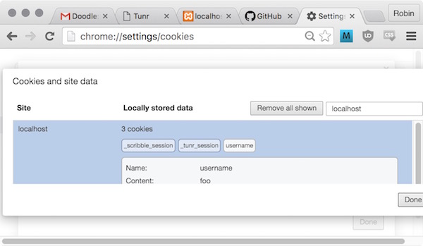

# Adding Cookies

## Framing

One thing we see all the time that uses cookies is the "Remember me?" function you see when logging in to various sites. This saves your username to a cookie, so that it's already filled in when you go back to the site. Nothing fancy; just a nice little user interface convenience.

We're going to add this to Tunr -- only we're going to remember users' usernames whether they like it or not.

In Rails, `cookies` is a hash available in every controller action, like `session`.

## [1. Make your sessions controller save the username to a cookie](https://github.com/ga-wdi-exercises/tunr_rails_users/commit/39b0773f8718302a031df3bb6912e4544fd37db0#diff-d5241d488259f32ecbe2f636133e5ddaR5)

## [2. Make that username show up when a user goes to signs in](https://github.com/ga-wdi-exercises/tunr_rails_users/commit/39b0773f8718302a031df3bb6912e4544fd37db0#diff-d5241d488259f32ecbe2f636133e5ddaR14)

## 3. Sign in, and then look for your cookie in Chrome!



### Further reading

You can set the **expiration date** of a cookie -- that is, when the browser "forgets" a cookie. Therefore, you can set how long a session should last.

By default, a cookie expires when the user closes their browser, but you can make it expire after any length of time. This is the reason your banking website might say, "Your session expired after 30 minutes of inactivity."

We're not going to cover how to set expiration dates in this class, but the format looks like this:

```rb
cookies[:username] = {value: @user.username, expires: 1.hour.from_now}
```
