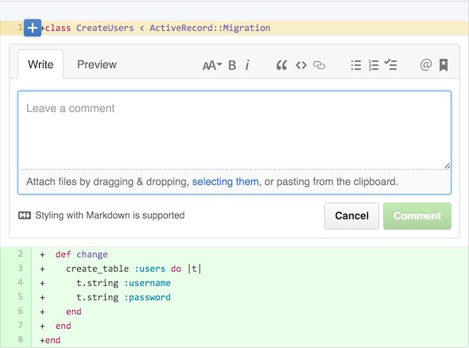

# Sessions, Cookies, Errors, and Flash

## Learning Objectives
- Contrast the use cases for cookies, sessions, and permanent storage.
- Define and then access a session variable in a Rails application.
- Add sign-in, sign-up, and sign-out functionality to a Rails application.

## Framing

Currently, Tunr just supports one single "God" user. It would be nice if it could have multiple users. Each could have their own list of Artists and Songs that they'd added.

### [Please clone down this repo.](https://github.com/ga-wdi-exercises/tunr_rails_users)

This class is going to be mostly you walking through README files with a partner, adding functionality to Tunr.

In any step that asks you to add code, there will be a link to a "diff" page on Github that shows you that particular piece of code being added.

### Logistics

With your partner, please pick one computer to be the "driving" computer, and one to be the "navigating" computer.

All of the coding will be done on the "driving" computer; the "navigating" computer will be used for looking things up.

After each section, we'll ask you to *physically* switch computers: whoever was on the "driving" computer should start using the "navigating" computer, and vice-versa.

This means:

- By the end of class only one of the two computers will have any code on it.
- You will be using someone else's computer. (So wash your hands and cover your mouth when you sneeze.)

The reasons for this:

- To practice pair programming and rubber ducking
- Loading Github's "diff" pages is a little slow. Using two computers, you can speed things up by looking at the diff pages only on the "navigating" computer.
- All the code you'll be writing is on Github, so there's not really an advantage to writing it out

#### "But I want to comment the code!"

You can *comment on the commits themselves on Github*. (This is **optional**.) Your classmates will be able to see your comments, and you can see theirs!

When looking at a "diff" page, just mouse over the line number and a blue `+` box should show up. Click on it to add your comment.



#### Too many comments?

Github includes jQuery on all its webpages. To hide the comments, just open the console in your browser and enter:

```js
$(".inline-comments").hide()
```

## Adding Users

As you go, keep in mind the "Reflect" questions below which we'll address as a class.

### [You Do: Adding Users](adding-users.md)

### Reflect

- How does `f.password_field` protect you from malware and hackers?
- How could this be DRY-ed up? (Hint: There are 3 views that are almost identical.)
- How are users' passwords protected?

## Sessions

We need to figure out a way for Rails remember I'm signed in.

#### Why not create an "is_signed_in" column in my User table?

- How would Rails know how to sign out? More importantly, if multiple users are accessing the app, how would Rails know which signed in user is on which computer?

### [You Do: Adding Sessions](adding-sessions.md)

### Reflect

- What's the difference between `resources` and `resource`?
- True or false: Every controller has to have a model, and vice-versa.
- What's the difference between the Sessions controller and the Users controller?
- What's the benefit of putting a method in the Application Controller?
- What's is a `before_action`?
- What's the difference between `params` and `session`?

### Shortcomings

- How are you told if you entered the wrong password?
- What can you do when you're signed in that you can't when you're not signed in?

## Permissions

### [You Do: Add permissions](adding-permissions.md)

### Reflect

- How are permissions related to sessions?
- What's the difference between adding permissions on the front-end and the back-end?

## Flash

`puts`ing out error messages isn't very helpful, since the user is never going to be able to see them.

Rails gives us a handy method for showing error messages to users, called `flash`. It relies on sessions.

### [You Do: Adding Flash](adding-flash.md)

### Reflect

- Across how many browser requests or controller actions is a flash message available?
- What are the two conventional types of flash messages, and what's the difference between them?
- True or false: Flash should be used to store information from the database.

## Cookies

This next "You Do" is **individual**: it doesn't involve writing any code, so do it on your own computer.

### [You Do: Exploring Cookies](exploring-cookies.md)

### Reflect

- What's the difference between a cookie and a session?
- How do sessions use cookies?
- Cookies seem to be really concerned with security, considering "secure connections only", "accessible to script", expiration dates, and so on. Why?
- What would make you choose to put something in a cookie versus in a session?

Please go back to pair-programming:

### [You Do: Adding Cookies](adding-cookies.md)

## Important Note About Security

This version of Tunr breaks the fundamental rule of web security: Don't store passwords as plain text, even in a database. They should always be encrypted.

That said, security is *complicated*, and you shouldn't let it prevent you from making an app (hence why we're not worrying about it here).

## Easy wins we didn't cover

- For each Artist and Song, show the username of the person who submitted it
- On each User page, show all the Artists and Songs they've submitted
- Prevent someone from signing up with a username that's already in use
- What else?

These things have been addressed [in the solution branch.](https://github.com/ga-wdi-exercises/tunr_rails_users/pull/6)

## References

- Screencasts
  - WDI 8, Robin
    - [Part 1](https://youtu.be/3YK3qDwnkQ8)
    - [Part 2](https://youtu.be/w51DnoJUsLA)
    - [Part 3](https://youtu.be/YYEtEsFE9Mw)
    - [Part 4](https://youtu.be/N67YBiLkrSE)
    - [Part 5](https://youtu.be/3h34Guspvp8)
